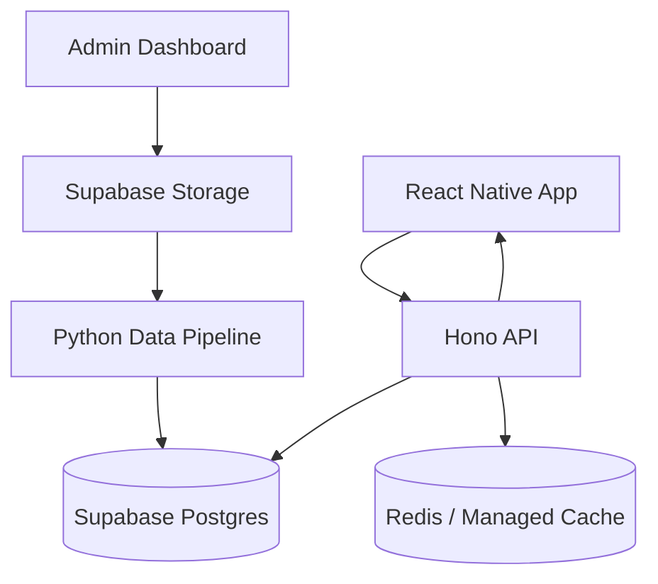

# High-Level Design

## 1. Architecture Goals

The system is designed to provide fast, explainable career-readiness guidance for students while keeping expensive data processing outside the user-facing request path.

Primary architecture goals:

- Support thousands of concurrent student requests.
- Keep career role matching and skill-gap analysis responsive.
- Separate data engineering from software engineering responsibilities.
- Use TypeScript for user-facing product services.
- Use Python only for offline data engineering and market intelligence preparation.
- Store prepared, versioned data in Supabase Postgres as the contract between Python and TypeScript.
- Avoid running heavy NLP, ETL, SDI computation, or LLM calls during required student request-response flows.
- Allow the system to start cost-efficiently and scale without a major rewrite.

## 2. System Context

From Campus to Career serves two main user groups:

- Students use the mobile application to enter academic records, choose target careers, view skill gaps, and follow roadmap recommendations.
- Admins manage skills, career roles, course mappings, datasets, and prepared market intelligence outputs.

The platform uses labor-market datasets and academic data to produce career readiness insights. Market intelligence is prepared ahead of time by Python data pipelines. The TypeScript application layer consumes that prepared data and serves fast responses to the mobile app and admin interface.

## 3. Recommended Technology Stack

| Layer | Technology | Responsibility |
| --- | --- | --- |
| Mobile app | React Native Expo + TypeScript | Student-facing mobile experience |
| API layer | Hono + TypeScript on Railway | Fast request-response API |
| Admin dashboard | Next.js + TypeScript | Admin operations and monitoring |
| Auth | Supabase Auth | User authentication and session management |
| Database | Supabase Postgres | Source of truth and prepared read models |
| Storage | Supabase Storage | CSV uploads and pipeline artifacts |
| Data engineering | Python 3.12 + Polars + Pydantic | Offline ETL, market intelligence, analytics |
| Cache/rate limit | Upstash Redis + `@upstash/ratelimit` | Cache, rate limits, idempotency helpers |
| Background jobs | Google Cloud Run Jobs + Cloud Scheduler | Python pipeline execution, scheduled ingestion, SDI recomputation, decay detection |
| CI/CD and manual triggers | GitHub Actions | Test automation, deployment workflows, optional early manual pipeline triggers |
| Notifications | Expo Push Notifications + `expo-notifications` | Student push notifications through the Expo mobile app |
| Observability | Sentry + Supabase Logs + Google Cloud Logging | App/API error tracking, database/auth/storage visibility, Python pipeline logs |

The stack intentionally separates the product runtime from the data engineering runtime:

```txt
Python prepares data.
TypeScript serves the product.
Supabase Postgres is the contract between them.
```

## 4. Major System Components

### Mobile Application

The mobile app provides student workflows:

- authentication
- profile setup
- course and grade entry
- target career input
- career role confirmation
- skill-gap result viewing
- readiness score viewing
- roadmap tracking
- notifications or updates

### Hono API

The Hono API is the main user-facing backend. It handles:

- authentication validation
- route protection
- request validation
- career role search
- student profile operations
- course and grade operations
- skill-gap analysis requests
- roadmap retrieval
- admin operations
- cache and idempotency checks

### Admin Dashboard

The admin dashboard supports:

- skill taxonomy management
- skill alias review
- career role management
- course catalog management
- course-to-skill mapping
- CSV upload or dataset registration
- pipeline status monitoring
- review of role skill requirements
- review of SDI and decay signals

### Python Data Engineering Pipeline

The Python layer prepares data needed by the product:

- CSV ingestion
- raw data cleaning
- job posting normalization
- skill extraction or mapping
- skill alias detection
- role skill requirement computation
- Skill Demand Index computation
- skill decay detection
- pipeline quality reports
- versioned output publishing

Python does not serve student or admin API requests directly.

### Supabase Postgres

Supabase Postgres stores:

- users and profiles
- courses and grades
- skills and aliases
- career roles
- course-to-skill mappings
- prepared role skill requirements
- student skill profiles
- analysis results
- roadmap items
- market snapshots
- skill decay signals
- pipeline job status

### Cache and Rate Limiting

Redis or a managed cache supports:

- role search cache
- skill-gap result cache
- rate limiting
- idempotency keys
- short-lived request coordination

The cache improves speed but must not be the system of record.

## 5. High-Level Data Flow

The system has two major flows:

```txt
Offline data preparation flow
-> prepares market and skill intelligence
-> writes versioned outputs to Postgres

User-facing product flow
-> reads prepared data
-> computes lightweight personalized results
-> returns fast responses
```

High-level flow:



## 6. User-Facing Request Flow

User-facing flows must stay lightweight and deterministic.

### Career Role Matching

```txt
Student enters free-text role
-> mobile app debounces input
-> Hono validates request
-> normalize query
-> check role alias cache
-> search prepared role aliases, exact titles, and `pg_trgm` fuzzy matches
-> return ranked role suggestions
```

LLM fallback may be used only for ambiguous cases and should not block the core search experience. `pgvector` is not part of the MVP.

### Skill-Gap Analysis

```txt
Student taps Analyze
-> Hono validates auth
-> check idempotency and cache
-> read student skill profile
-> read role skill requirements
-> compute gap scores and readiness score
-> store result snapshot
-> return response
```

The API must not ingest datasets, scan raw job postings, compute market-wide SDI, detect decay, or call Python during this request.

### Roadmap Retrieval

```txt
Student opens roadmap
-> Hono reads latest gap result
-> Hono reads recommendation catalog and roadmap templates
-> Hono returns prioritized roadmap items
```

Optional explanation enrichment may happen asynchronously after the core result exists.

## 7. Offline Market Intelligence Flow

The offline flow prepares the data that the application consumes.

```txt
Admin uploads or registers CSV
-> pipeline job is created
-> Python reads the file from Supabase Storage
-> Python validates and cleans rows
-> Python normalizes titles, roles, and skills
-> Python deduplicates job postings
-> Python extracts or maps skills
-> Python computes role skill requirements
-> Python computes SDI snapshots
-> Python detects skill decay signals
-> Python writes versioned monthly outputs, dataset lineage, and month-scoped current pointers to Postgres
-> Admin reviews results in dashboard
```

This flow can run on a schedule, after admin upload, or through a workflow runner. It is intentionally decoupled from student requests.

## 8. Background Workflow Strategy

The first production-friendly version uses scheduled and event-triggered jobs with Google Cloud Run Jobs and Cloud Scheduler:

- dataset ingestion job
- role requirement computation job
- SDI snapshot job
- skill decay detection job
- student skill profile recomputation job
- optional LLM enrichment job

Pipeline status changes are persisted in `pipeline_jobs` and emitted through `app_events`. The admin dashboard should receive authenticated server-pushed status notifications from the API and refetch authoritative job details through API routes, rather than continuously polling for job completion.

Growth-stage options:

- Temporal for durable, cross-language workflows
- managed queues for pipeline orchestration
- separate worker services for Python data pipelines

The workflow layer should support:

- retries
- job status tracking
- failure logging
- resumable processing where needed
- versioned output publishing

## 9. Authentication and Authorization

Supabase Auth handles authentication. The API validates user sessions and enforces authorization before calling services.

Roles:

- `student`: can access only their own profile, course records, skill-gap results, roadmap items, and notifications.
- `admin`: can manage career roles, skills, aliases, courses, mappings, datasets, and pipeline outputs.

Security requirements:

- Client apps must not receive service-role keys.
- Admin routes must require admin authorization.
- Student data access must be scoped to the authenticated user.
- Backend operations that bypass RLS must be wrapped in trusted server-side code.

## 10. Data Storage Strategy

Supabase Postgres is the primary database. It stores both transactional product data and prepared intelligence data.

Transactional data:

- users
- student profiles
- student courses
- roadmap progress
- analysis history

Reference data:

- career roles
- skills
- skill aliases
- courses
- course-to-skill mappings
- recommendation catalog

Prepared intelligence data:

- student skill profiles
- role skill requirements by immutable requirement version and monthly revision
- SDI snapshots by requirement version so same-month republishes can coexist
- skill decay signals whose active state is scoped to the requirement version's month
- dataset lineage rows for each published role requirement version
- role search indexes
- cached analysis results

Pipeline data:

- ingestion jobs
- rejected rows
- pipeline logs
- dataset versions
- role-skill evidence summaries
- market snapshot versions

## 11. Caching and Precomputation Strategy

The architecture depends on precomputation for speed.

Precomputed data includes:

- career role aliases
- role search data
- course-to-skill mappings
- student skill profiles
- role skill requirements
- SDI snapshots
- decay signals
- roadmap recommendation templates

Cacheable user-facing data includes:

- career role search results
- latest student skill profile summary
- skill-gap results by version
- roadmap results by analysis version

Suggested cache keys:

```txt
role_search:{normalized_query}
student_skill_profile:{student_id}:{profile_version}
skill_gap:{student_id}:{role_id}:{profile_version}:{role_requirement_version}
roadmap:{analysis_result_id}:{catalog_version}
```

Cache entries should be invalidated or bypassed when relevant versions change.

## 12. Scalability and Concurrency Strategy

The system is designed around fast reads and small calculations.

When 1,000 students request skill-gap analysis concurrently:

```txt
1000 requests hit Hono
-> each request validates auth
-> each request checks cache/idempotency
-> each request reads prepared student and role data
-> each request computes lightweight scores
-> each request writes or reuses a result snapshot
-> each request returns without waiting for Python
```

Scalability rules:

- Do not run heavy market processing in student requests.
- Use precomputed role requirements instead of raw job postings.
- Use cached analysis results when versions have not changed.
- Deduplicate repeated requests from the same student and role.
- Use rate limits for abusive or accidental spikes.
- Use database indexes for common lookup paths.
- Use connection pooling where needed.
- Scale API and data pipelines independently.

Concurrency protections:

- idempotency key per student-role-version analysis
- one active analysis per student-role-version pair
- cache-first read for repeated requests
- backpressure for overload conditions
- clear degraded response when fresh analysis cannot be produced immediately

## 13. Reliability and Failure Handling

The application should continue serving students even if the data pipeline is temporarily unavailable.

Failure handling rules:

- If Python pipeline fails, keep serving the latest successful prepared data.
- If role requirements are stale, show the latest current monthly version with freshness and period metadata where needed.
- If cache is unavailable, fall back to database reads.
- If LLM enrichment fails, use deterministic or template-based explanations.
- If dataset ingestion fails, record the failure and expose it to admins.
- If user analysis fails, preserve the failure state and allow retry.

Pipeline jobs should record:

- status
- started time
- finished time
- source dataset
- processed row count
- rejected row count
- error summary
- output version

## 14. Security and Privacy Considerations

Security priorities:

- protect student academic records
- enforce role-based access control
- avoid client exposure of privileged keys
- validate uploaded datasets
- audit admin changes
- sanitize raw text before processing
- protect API routes with auth middleware

Privacy considerations:

- Students should only see their own analysis data.
- Admin access should be limited and auditable.
- Dataset uploads should avoid unnecessary personally identifiable information.
- Data retention policies should be defined before production deployment.

## 15. Observability and Monitoring

The system should track both product health and data pipeline health.

API metrics:

- request count
- error rate
- p50/p95/p99 latency
- cache hit rate
- rate-limit events
- concurrent analyze request count

Database metrics:

- slow queries
- connection usage
- index usage
- storage growth
- read/write volume

Pipeline metrics:

- ingestion success rate
- failed job count
- processing duration
- rejected row count
- unknown skill alias count
- market snapshot freshness

Product metrics:

- profile completion rate
- career intent submission rate
- skill-gap completion rate
- roadmap engagement rate
- returning user rate

## 16. Deployment Topology

Early-stage cost-efficient deployment:

```txt
React Native Expo
-> EAS build/deploy for mobile

Hono API
-> Railway

Admin Dashboard
-> Next.js deployment target of choice, with Vercel as the default

Database/Auth/Storage
-> Supabase

Cache/Rate Limit
-> Upstash Redis

Python Data Pipeline
-> Google Cloud Run Jobs

Schedules
-> Cloud Scheduler
```

Growth-stage deployment:

```txt
Hono API
-> Railway for MVP, with Cloud Run as a later migration path if needed

Python Pipeline Workers
-> Cloud Run Jobs or dedicated worker service

Workflow Engine
-> Temporal or managed workflow service

Database
-> Supabase paid tier with connection pooling and stronger limits

Cache
-> managed Redis with production limits
```

The deployment may be scattered across providers early to maximize free tiers and speed of setup. The architecture should keep provider boundaries clear so individual pieces can move later.

## 17. Architecture Tradeoffs

### Benefits

- TypeScript gives one language for mobile, API, admin, and product logic.
- Python gives access to strong data engineering and ML tooling.
- The student experience stays fast because Python is not in the request path.
- Prepared data makes concurrent analysis scalable.
- Supabase reduces early infrastructure burden.
- Hono keeps the API lightweight and portable.

### Costs

- Two runtimes must be maintained.
- Database contracts must be carefully versioned.
- Pipeline output must be tested against TypeScript consumers.
- Free-tier infrastructure may require provider-specific setup.
- More discipline is needed around data freshness and stale outputs.

### Final Decision

The architecture uses a split-responsibility model:

```txt
Python owns offline data engineering and market intelligence preparation.
TypeScript owns user-facing software engineering and product delivery.
Supabase Postgres acts as the versioned contract between both layers.
```

This keeps development flexible, preserves data-science capability, and allows the application to stay fast for thousands of concurrent users.

## 18. Finalized Architecture Decisions

The following decisions are locked for implementation:

- `arch.md` is the canonical architecture decision record.
- The API will be deployed on Railway for the MVP.
- The admin dashboard will use Next.js.
- Drizzle ORM is the TypeScript data-access standard.
- Student skill-profile recomputation is synchronous on course or mapping changes in the MVP.
- Career search uses deterministic alias plus `pg_trgm` search in Supabase Postgres.
- `pgvector` is explicitly deferred and is not part of the MVP architecture.
- A lightweight `app_events` outbox table will exist in the MVP for durable internal eventing.
- Admin pipeline status updates use API-owned authenticated realtime notifications backed by `app_events`; the database remains the source of truth.
- Cloud Run Jobs and Cloud Scheduler are the only approved workflow runtime for Python in the MVP.
- Cloud Run remains an approved future migration target for the API, but not the MVP hosting choice.

## 19. State and Contract Strategy

State strategy:

- TanStack Query owns client server state in mobile and admin.
- React local state owns screen-local and form-local UI state.
- Zustand is allowed only for cross-screen transient UI state.
- Upstash Redis is used only for cache, idempotency, and rate limiting.

Contract strategy:

- Supabase Postgres is the single source of truth.
- Python publishes immutable, versioned market-intelligence outputs.
- Python publishes immutable monthly market-intelligence outputs with explicit dataset lineage and one current pointer per `period_month`.
- TypeScript consumes published outputs and owns user-facing mutations.
- Shared request and response contracts must be defined once and reused across mobile, admin, and API.

## 20. Architecture Success Criteria

The architecture is considered final and ready for development when:

- there are no unresolved architectural placeholders across `arch.md`, `HLD.md`, or `LLD.md`
- a single authoritative data model exists for identity, academic data, taxonomy, market intelligence, analysis, roadmap, and workflow state
- all public APIs are versioned under `/api/v1` and defined through shared contracts
- student request-response flows do not call Python or scan raw market data
- the system can support 1,000 concurrent analysis requests through prepared reads and deterministic scoring
- Redis failure degrades performance only, not correctness
- pipeline failure does not block the app from serving the latest successful published version
