# Low-Level Design

## 1. Backend Module Structure

The backend is organized as a TypeScript-first monorepo with a separate Python data engineering application.

```txt
from-campus-to-career/
  apps/
    mobile/
    api/
    admin/
    data-pipeline/
  packages/
    shared/
    database/
    config/
    api-client/
  docs/
```

### TypeScript API Structure

```txt
apps/api/src/
  index.ts
  app.ts
  routes/
  middleware/
  services/
  repositories/
  domain/
  db/
  cache/
  integrations/
  config/
  tests/
```

Responsibilities:

- `routes`: HTTP endpoint definitions.
- `middleware`: authentication, role checks, rate limiting, validation, and error handling.
- `services`: application use cases and orchestration.
- `repositories`: database access.
- `domain`: pure business rules and scoring functions.
- `db`: database client and schema bindings.
- `cache`: cache client, keys, and cache-specific helpers.
- `integrations`: Supabase, notification, and optional LLM clients.
- `config`: environment variables and constants.

### Python Data Pipeline Structure

```txt
apps/data-pipeline/src/
  main.py
  ingestion/
  normalization/
  intelligence/
  publishing/
  db/
  config/
  tests/
```

Responsibilities:

- `ingestion`: CSV reading, row validation, cleaning, and deduplication.
- `normalization`: job title, skill, and role normalization.
- `intelligence`: skill extraction, SDI computation, role requirement computation, and decay detection.
- `publishing`: writes versioned outputs to Supabase Postgres.
- `db`: database connection and repository helpers.
- `config`: pipeline settings and environment variables.

Python must not serve user-facing HTTP requests.

## 2. API Route Design

All user-facing APIs are served by Hono.

Base path:

```txt
/api/v1
```

### Auth Routes

| Method | Path            | Purpose                                               |
| ------ | --------------- | ----------------------------------------------------- |
| `POST` | `/auth/session` | Validate Supabase session and return app user summary |
| `POST` | `/auth/logout`  | Clear server-side session artifacts if used           |

### Student Profile Routes

| Method | Path                        | Purpose                                   |
| ------ | --------------------------- | ----------------------------------------- |
| `GET`  | `/profile/me`               | Get authenticated student profile         |
| `PUT`  | `/profile/me`               | Update authenticated student profile      |
| `GET`  | `/profile/me/skill-profile` | Get latest computed student skill profile |

### Course Routes

| Method   | Path                   | Purpose                           |
| -------- | ---------------------- | --------------------------------- |
| `GET`    | `/courses`             | List available courses            |
| `GET`    | `/student/courses`     | List student's courses and grades |
| `POST`   | `/student/courses`     | Add a course and grade            |
| `PUT`    | `/student/courses/:id` | Update a course and grade entry   |
| `DELETE` | `/student/courses/:id` | Remove a course entry             |

### Career Routes

| Method | Path                 | Purpose                                       |
| ------ | -------------------- | --------------------------------------------- |
| `GET`  | `/careers/search?q=` | Return ranked role suggestions from free text |
| `GET`  | `/careers/:roleId`   | Get career role details                       |
| `POST` | `/careers/confirm`   | Set or confirm student's target role          |

### Skill Gap Routes

| Method | Path                      | Purpose                                     |
| ------ | ------------------------- | ------------------------------------------- |
| `POST` | `/skills/analyze`         | Run fast skill-gap analysis for target role |
| `GET`  | `/skills/analysis/latest` | Get latest skill-gap analysis               |
| `GET`  | `/skills/analysis/:id`    | Get a specific analysis result              |
| `GET`  | `/skills/decay-alerts`    | Get relevant skill decay alerts             |

### Roadmap Routes

| Method | Path                        | Purpose                         |
| ------ | --------------------------- | ------------------------------- |
| `GET`  | `/roadmap`                  | Get roadmap for latest analysis |
| `POST` | `/roadmap/:itemId/complete` | Mark roadmap item as complete   |
| `POST` | `/roadmap/:itemId/reopen`   | Reopen completed roadmap item   |

### Admin Routes

| Method | Path | Purpose |
| --- | --- | --- |
| `GET` | `/admin/roles` | List career roles |
| `POST` | `/admin/roles` | Create career role |
| `PUT` | `/admin/roles/:id` | Update career role |
| `GET` | `/admin/skills` | List skills |
| `POST` | `/admin/skills` | Create skill |
| `PUT` | `/admin/skills/:id` | Update skill |
| `GET` | `/admin/skill-aliases` | List skill aliases |
| `PUT` | `/admin/skill-aliases/:id/review` | Review or approve alias |
| `GET` | `/admin/courses` | List courses |
| `POST` | `/admin/courses` | Create course |
| `PUT` | `/admin/courses/:id` | Update course |
| `POST` | `/admin/course-skills` | Create or update course-skill mapping |
| `GET` | `/admin/recommendations` | List recommendation catalog items |
| `POST` | `/admin/recommendations` | Create recommendation catalog item |
| `PUT` | `/admin/recommendations/:id` | Update recommendation catalog item |
| `POST` | `/admin/datasets` | Register uploaded dataset |
| `POST` | `/admin/datasets/:id/ingest` | Trigger ingestion job |
| `GET` | `/admin/pipeline-jobs` | List pipeline jobs |
| `GET` | `/admin/pipeline-jobs/:id` | Get pipeline job details |
| `GET` | `/admin/pipeline-job-events` | Subscribe to authenticated pipeline job status notifications |

## 3. Request and Response Contracts

Contracts should be defined with a shared schema library such as Zod and exported from `packages/shared`.

### Career Search Request

```ts
type CareerSearchQuery = {
  q: string;
  limit?: number;
};
```

### Career Search Response

```ts
type CareerSearchResponse = {
  query: string;
  normalizedQuery: string;
  results: Array<{
    roleId: string;
    title: string;
    confidence: number;
    matchType: "exact" | "alias" | "keyword" | "embedding" | "fallback";
  }>;
};
```

### Skill Analyze Request

```ts
type SkillAnalyzeRequest = {
  roleId: string;
  idempotencyKey?: string;
};
```

### Skill Analyze Response

```ts
type SkillAnalyzeResponse = {
  analysisId: string;
  studentId: string;
  roleId: string;
  profileVersion: number;
  roleRequirementVersion: number;
  readinessScore: number;
  cacheStatus: "hit" | "miss" | "reused";
  gaps: Array<{
    skillId: string;
    skillName: string;
    requiredDepth: number;
    studentDepth: number;
    demandWeight: number;
    gapScore: number;
    priority: number;
  }>;
};
```

### Pipeline Job Response

```ts
type PipelineJobResponse = {
  id: string;
  datasetId: string;
  status: "pending" | "running" | "complete" | "failed" | "partial";
  processedRows: number;
  rejectedRows: number;
  outputVersion?: number;
  errorMessage?: string;
  createdAt: string;
  startedAt?: string;
  finishedAt?: string;
};
```

```ts
type PipelineJobStatusEvent = {
  type: "pipeline.ingestion.completed" | "pipeline.ingestion.failed";
  pipelineJobId: string;
  status: "complete" | "failed" | "partial";
};
```

Pipeline job status notifications are delivered through an authenticated API-owned realtime channel such as SSE or WebSocket. The notification payload must only contain routing identifiers and safe status metadata. Admin clients must refetch `PipelineJobResponse` through the normal API route after receiving a notification.

## 4. ORM and Type-Safety Contracts

The system must enforce type safety inside each ecosystem and at every boundary between ecosystems.

Core rule:

```txt
Every external boundary must have both compile-time types and runtime validation.
```

Recommended tooling:

| Layer                           | Tooling                  | Purpose                                                 |
| ------------------------------- | ------------------------ | ------------------------------------------------------- |
| TypeScript database access      | Drizzle ORM              | Typed schema, typed queries, migrations                 |
| API request/response validation | Zod                      | Runtime validation and inferred TypeScript contracts    |
| Shared TypeScript contracts     | `packages/shared`        | Reusable schemas and types for API, mobile, admin       |
| Python pipeline validation      | Pydantic                 | Runtime validation for raw, cleaned, and published data |
| Python static typing            | pyright                  | Static checks for data pipeline code                    |
| Database constraints            | Supabase Postgres        | Source-of-truth integrity rules                         |
| Contract tests                  | Vitest + pytest fixtures | Verify Python outputs can be consumed by TypeScript     |

### TypeScript ORM

The TypeScript backend should use Drizzle for app data access and schema-aware queries.

Responsibilities:

- define database tables in TypeScript
- generate typed query results
- support migrations through Drizzle Kit
- keep SQL behavior explicit and reviewable
- avoid untyped database access in product services

Suggested package structure:

```txt
packages/database/src/
  client.ts
  schema/
    users.ts
    students.ts
    courses.ts
    skills.ts
    roles.ts
    market.ts
    analysis.ts
    roadmap.ts
    pipeline.ts
  migrations/
```

The Supabase client should still be used for Supabase Auth and Supabase Storage operations. Product data should be accessed through Drizzle where possible.

### API Contracts

Zod schemas must define API request and response contracts.

Suggested structure:

```txt
packages/shared/src/contracts/
  auth.contract.ts
  profile.contract.ts
  courses.contract.ts
  career.contract.ts
  skill-gap.contract.ts
  roadmap.contract.ts
  admin.contract.ts
  pipeline.contract.ts
```

Each contract should export:

- request schema
- response schema
- inferred TypeScript request type
- inferred TypeScript response type

Example:

```ts
export const SkillAnalyzeRequestSchema = z.object({
  roleId: z.string().uuid(),
  idempotencyKey: z.string().optional(),
});

export type SkillAnalyzeRequest = z.infer<typeof SkillAnalyzeRequestSchema>;
```

The API must validate incoming payloads at runtime even when the frontend uses shared TypeScript types.

### Frontend Contracts

The mobile app and admin dashboard should consume shared contracts from `packages/shared`.

Rules:

- API responses must be parsed or validated before use.
- Form schemas should align with shared request schemas.
- Navigation params should be typed.
- Avoid `any` for API payloads, form state, and route params.
- UI code should not depend on raw database table shapes unless intentionally exposed through an API contract.

### Python Data Contracts

The Python data pipeline should use Pydantic models for each pipeline stage.

Suggested structure:

```txt
apps/data-pipeline/src/contracts/
  raw_job_posting.py
  cleaned_job_posting.py
  normalized_job_posting.py
  role_skill_requirement.py
  sdi_snapshot.py
  skill_decay_signal.py
  rejected_row.py
```

Pydantic model categories:

- raw CSV row models
- cleaned row models
- normalized row models
- published output models
- rejected row models

Python-published output models must match the database schema expected by TypeScript readers.

### Cross-Ecosystem Contract Tests

The most important boundary is:

```txt
Python publishes prepared data.
TypeScript consumes prepared data.
```

Contract tests must verify:

- Python can publish a sample role requirement version.
- TypeScript can read the published role requirements.
- TypeScript skill-gap service can compute a result from Python-published data.
- Published numeric values respect expected ranges.
- Required foreign keys and version fields exist.

Minimum contract test flow:

```txt
load sample CSV
-> run Python pipeline against test database
-> publish prepared outputs
-> run TypeScript skill-gap service against same database
-> assert valid analysis result
```

### Database Contract Rules

Database migrations and constraints are the final source of truth.

Rules:

- All schema changes must be represented as migrations.
- Drizzle schema must match applied migrations.
- Pydantic publish models must match target database tables.
- Breaking schema changes must update TypeScript contracts, Python models, and contract tests in the same PR.
- Foreign keys, unique constraints, and check constraints should enforce critical integrity rules.

## 5. Database Schema

The database is the contract between the TypeScript application and the Python data pipeline.

### Mermaid ERD

```mermaid
erDiagram
    USERS {
        uuid id PK
        text email
        text role
        timestamptz created_at
    }

    STUDENT_PROFILES {
        uuid id PK
        uuid user_id FK
        text full_name
        text program
        text university
        date expected_grad
        uuid target_role_id FK
        int profile_version
        timestamptz created_at
        timestamptz updated_at
    }

    COURSES {
        uuid id PK
        text code
        text title
        int units
        text description
        boolean is_active
    }

    STUDENT_COURSES {
        uuid id PK
        uuid student_id FK
        uuid course_id FK
        numeric grade
        text semester
        timestamptz created_at
        timestamptz updated_at
    }

    SKILLS {
        uuid id PK
        text name
        text category
        boolean is_active
        timestamptz created_at
    }

    SKILL_ALIASES {
        uuid id PK
        uuid skill_id FK
        text alias
        text source
        boolean reviewed
        timestamptz created_at
    }

    COURSE_SKILLS {
        uuid id PK
        uuid course_id FK
        uuid skill_id FK
        numeric depth_weight
    }

    CAREER_ROLES {
        uuid id PK
        text title
        text description
        boolean is_active
        timestamptz created_at
    }

    CAREER_ROLE_ALIASES {
        uuid id PK
        uuid role_id FK
        text alias
        text normalized_alias
        timestamptz created_at
    }

    MARKET_DATASETS {
        uuid id PK
        text file_path
        text source
        text status
        uuid uploaded_by FK
        timestamptz created_at
    }

    JOB_POSTINGS {
        uuid id PK
        uuid dataset_id FK
        text source
        text title
        text company
        text raw_text
        uuid role_id FK
        date posted_at
        timestamptz ingested_at
    }

    JOB_POSTING_SKILLS {
        uuid id PK
        uuid job_posting_id FK
        uuid role_id FK
        uuid skill_id FK
        numeric normalized_depth
        timestamptz created_at
    }

    STUDENT_SKILL_PROFILES {
        uuid id PK
        uuid student_id FK
        int profile_version
        timestamptz computed_at
    }

    STUDENT_SKILL_PROFILE_ITEMS {
        uuid id PK
        uuid profile_id FK
        uuid skill_id FK
        numeric depth
        jsonb evidence
    }

    ROLE_REQUIREMENT_VERSIONS {
        uuid id PK
        int version
        uuid dataset_id FK
        date period_month
        int period_revision
        timestamptz computed_at
        boolean is_current
    }

    ROLE_REQUIREMENT_VERSION_DATASETS {
        int requirement_version FK
        uuid dataset_id FK
        timestamptz linked_at
    }

    ROLE_SKILL_REQUIREMENTS {
        uuid id PK
        uuid role_id FK
        uuid skill_id FK
        int requirement_version
        numeric required_depth
        numeric demand_weight
        int evidence_count
    }

    SDI_SNAPSHOTS {
        uuid id PK
        uuid role_id FK
        uuid skill_id FK
        numeric demand_index
        date snapshot_date
        int requirement_version
    }

    SKILL_DECAY_SIGNALS {
        uuid id PK
        uuid role_id FK
        uuid skill_id FK
        numeric decay_rate
        numeric confidence
        timestamptz detected_at
        int requirement_version
        boolean is_active
    }

    SKILL_GAP_RESULTS {
        uuid id PK
        uuid student_id FK
        uuid role_id FK
        int profile_version
        int role_requirement_version
        numeric readiness_score
        timestamptz created_at
    }

    SKILL_GAP_RESULT_ITEMS {
        uuid id PK
        uuid result_id FK
        uuid skill_id FK
        numeric required_depth
        numeric student_depth
        numeric demand_weight
        numeric gap_score
        int priority
    }

    RECOMMENDATION_CATALOG {
        uuid id PK
        uuid skill_id FK
        text item_type
        text title
        text description
        text url
        text difficulty
        int estimated_hours
        boolean is_active
    }

    ROADMAP_ITEMS {
        uuid id PK
        uuid student_id FK
        uuid analysis_result_id FK
        uuid recommendation_id FK
        int priority
        text status
        text explanation
        timestamptz created_at
        timestamptz completed_at
    }

    PIPELINE_JOBS {
        uuid id PK
        uuid dataset_id FK
        text job_type
        text status
        int processed_rows
        int rejected_rows
        int output_version
        text error_message
        timestamptz started_at
        timestamptz finished_at
        timestamptz created_at
    }

    APP_EVENTS {
        uuid id PK
        text event_type
        text aggregate_type
        uuid aggregate_id
        jsonb payload
        text status
        timestamptz available_at
        timestamptz processed_at
        text error_message
        timestamptz created_at
    }

    PIPELINE_REJECTED_ROWS {
        uuid id PK
        uuid pipeline_job_id FK
        int row_number
        jsonb raw_payload
        text reason
        timestamptz created_at
    }

    PIPELINE_SKILL_EVIDENCE_SUMMARY {
        uuid id PK
        uuid dataset_id FK
        uuid pipeline_job_id FK
        uuid role_id FK
        uuid skill_id FK
        int evidence_count
        boolean threshold_met
        timestamptz created_at
    }

    USERS ||--|| STUDENT_PROFILES : "owns"
    USERS ||--o{ MARKET_DATASETS : "uploads"
    CAREER_ROLES ||--o{ STUDENT_PROFILES : "targeted by"
    STUDENT_PROFILES ||--o{ STUDENT_COURSES : "takes"
    COURSES ||--o{ STUDENT_COURSES : "included in"
    SKILLS ||--o{ SKILL_ALIASES : "has aliases"
    COURSES ||--o{ COURSE_SKILLS : "maps"
    SKILLS ||--o{ COURSE_SKILLS : "mapped from"
    CAREER_ROLES ||--o{ CAREER_ROLE_ALIASES : "has aliases"
    MARKET_DATASETS ||--o{ JOB_POSTINGS : "contains"
    CAREER_ROLES ||--o{ JOB_POSTINGS : "classified as"
    JOB_POSTINGS ||--o{ JOB_POSTING_SKILLS : "maps skills"
    CAREER_ROLES ||--o{ JOB_POSTING_SKILLS : "skill evidence for"
    SKILLS ||--o{ JOB_POSTING_SKILLS : "posting evidence"
    STUDENT_PROFILES ||--o{ STUDENT_SKILL_PROFILES : "produces"
    STUDENT_SKILL_PROFILES ||--o{ STUDENT_SKILL_PROFILE_ITEMS : "contains"
    SKILLS ||--o{ STUDENT_SKILL_PROFILE_ITEMS : "measured by"
    MARKET_DATASETS ||--o{ ROLE_REQUIREMENT_VERSIONS : "triggers"
    MARKET_DATASETS ||--o{ ROLE_REQUIREMENT_VERSION_DATASETS : "contributes to"
    ROLE_REQUIREMENT_VERSIONS ||--o{ ROLE_REQUIREMENT_VERSION_DATASETS : "has lineage"
    ROLE_REQUIREMENT_VERSIONS ||--o{ ROLE_SKILL_REQUIREMENTS : "versions"
    CAREER_ROLES ||--o{ ROLE_SKILL_REQUIREMENTS : "requires"
    SKILLS ||--o{ ROLE_SKILL_REQUIREMENTS : "required skill"
    CAREER_ROLES ||--o{ SDI_SNAPSHOTS : "tracked for"
    SKILLS ||--o{ SDI_SNAPSHOTS : "tracked skill"
    CAREER_ROLES ||--o{ SKILL_DECAY_SIGNALS : "decays in"
    SKILLS ||--o{ SKILL_DECAY_SIGNALS : "decaying skill"
    STUDENT_PROFILES ||--o{ SKILL_GAP_RESULTS : "analyzed for"
    CAREER_ROLES ||--o{ SKILL_GAP_RESULTS : "benchmarked against"
    SKILL_GAP_RESULTS ||--o{ SKILL_GAP_RESULT_ITEMS : "contains"
    SKILLS ||--o{ SKILL_GAP_RESULT_ITEMS : "gap skill"
    SKILLS ||--o{ RECOMMENDATION_CATALOG : "recommended for"
    STUDENT_PROFILES ||--o{ ROADMAP_ITEMS : "owns"
    SKILL_GAP_RESULTS ||--o{ ROADMAP_ITEMS : "drives"
    RECOMMENDATION_CATALOG ||--o{ ROADMAP_ITEMS : "references"
    MARKET_DATASETS ||--o{ PIPELINE_JOBS : "processed by"
    PIPELINE_JOBS ||--o{ PIPELINE_REJECTED_ROWS : "rejects"
    MARKET_DATASETS ||--o{ PIPELINE_SKILL_EVIDENCE_SUMMARY : "summarizes evidence from"
    PIPELINE_JOBS ||--o{ PIPELINE_SKILL_EVIDENCE_SUMMARY : "produces evidence"
    CAREER_ROLES ||--o{ PIPELINE_SKILL_EVIDENCE_SUMMARY : "evidence for"
    SKILLS ||--o{ PIPELINE_SKILL_EVIDENCE_SUMMARY : "evidenced skill"
```



### Core User Tables

Identity note:

- `auth.users` in Supabase Auth is the source of truth for authentication.
- `users.id` must match `auth.users.id` exactly and stores app-specific role and status metadata.

```txt
users
- id uuid primary key
- email text unique not null
- role text not null
- created_at timestamptz not null
```

```txt
student_profiles
- id uuid primary key
- user_id uuid unique not null references users(id)
- full_name text
- program text
- university text
- expected_grad date
- target_role_id uuid references career_roles(id)
- profile_version int not null default 1
- created_at timestamptz not null
- updated_at timestamptz not null
```

### Course and Skill Tables

```txt
courses
- id uuid primary key
- code text unique not null
- title text not null
- units int
- description text
- is_active boolean default true
```

```txt
student_courses
- id uuid primary key
- student_id uuid not null references student_profiles(id)
- course_id uuid not null references courses(id)
- grade numeric(4,2)
- semester text
- created_at timestamptz not null
- updated_at timestamptz not null
- unique(student_id, course_id, semester)
```

```txt
skills
- id uuid primary key
- code text unique not null
- name text unique not null
- category text
- notes text
- is_active boolean default true
- created_at timestamptz not null
```

```txt
skill_aliases
- id uuid primary key
- code text unique not null
- skill_id uuid references skills(id)
- alias text unique not null
- normalized_alias text unique not null
- source text
- notes text
- reviewed boolean default false
- created_at timestamptz not null
```

Skill alias review state is derived:

- pending: `reviewed = false`, `skill_id = null`
- approved: `reviewed = true`, `skill_id is not null`
- dismissed: `reviewed = true`, `skill_id = null`

```txt
course_skills
- id uuid primary key
- course_id uuid not null references courses(id)
- skill_id uuid not null references skills(id)
- depth_weight numeric(3,2) not null default 1.0
- unique(course_id, skill_id)
- check(depth_weight > 0 and depth_weight <= 1)
```

Admin mapping APIs expose depth as `0.01..1.00`.

### Career and Market Tables

```txt
career_roles
- id uuid primary key
- code text unique not null
- title text unique not null
- description text
- category text
- is_active boolean default true
- created_at timestamptz not null
```

```txt
career_role_aliases
- id uuid primary key
- code text unique not null
- role_id uuid not null references career_roles(id)
- alias text unique not null
- normalized_alias text not null
- reviewed boolean not null default true
- created_at timestamptz not null
```

```txt
market_datasets
- id uuid primary key
- file_path text not null
- source text
- source_url text
- status text not null
- uploaded_by uuid references users(id)
- created_at timestamptz not null
```

```txt
job_postings
- id uuid primary key
- dataset_id uuid references market_datasets(id)
- source text
- title text
- company text
- raw_text text
- role_id uuid references career_roles(id)
- posted_at date
- ingested_at timestamptz not null
- unique(source, title, company, posted_at)
```

```txt
job_posting_skills
- id uuid primary key
- job_posting_id uuid not null references job_postings(id)
- role_id uuid not null references career_roles(id)
- skill_id uuid not null references skills(id)
- normalized_depth numeric(5,4)
- created_at timestamptz not null
- unique(job_posting_id, role_id, skill_id)
- check(normalized_depth is null or normalized_depth between 0 and 1)
```

### Prepared Intelligence Tables

```txt
student_skill_profiles
- id uuid primary key
- student_id uuid not null references student_profiles(id)
- profile_version int not null
- computed_at timestamptz not null
- unique(student_id, profile_version)
```

```txt
student_skill_profile_items
- id uuid primary key
- profile_id uuid not null references student_skill_profiles(id)
- skill_id uuid not null references skills(id)
- depth numeric(5,4) not null
- evidence jsonb
- unique(profile_id, skill_id)
```

```txt
role_requirement_versions
- id uuid primary key
- version int unique not null
- dataset_id uuid references market_datasets(id)
- period_month date not null
- period_revision int not null
- computed_at timestamptz not null
- is_current boolean default false
- unique(period_month, period_revision)
- unique(period_month) where is_current = true
- check(period_revision > 0)
- check(date_trunc('month', period_month) = period_month)
```

```txt
role_requirement_version_datasets
- requirement_version int not null references role_requirement_versions(version)
- dataset_id uuid not null references market_datasets(id)
- linked_at timestamptz not null default now()
- unique(requirement_version, dataset_id)
```

```txt
role_skill_requirements
- id uuid primary key
- role_id uuid not null references career_roles(id)
- skill_id uuid not null references skills(id)
- requirement_version int not null references role_requirement_versions(version)
- required_depth numeric(5,4) not null
- demand_weight numeric(5,4) not null
- evidence_count int default 0
- unique(role_id, skill_id, requirement_version)
```

```txt
sdi_snapshots
- id uuid primary key
- role_id uuid not null references career_roles(id)
- skill_id uuid not null references skills(id)
- demand_index numeric(5,4) not null
- snapshot_date date not null
- requirement_version int not null references role_requirement_versions(version)
- unique(role_id, skill_id, snapshot_date, requirement_version)
```

```txt
skill_decay_signals
- id uuid primary key
- role_id uuid not null references career_roles(id)
- skill_id uuid not null references skills(id)
- decay_rate numeric(5,4) not null
- confidence numeric(5,4) not null
- detected_at timestamptz not null
- requirement_version int not null references role_requirement_versions(version)
- is_active boolean default true
- check(decay_rate >= -1 and decay_rate <= 0)
- check(confidence >= 0 and confidence <= 1)
```

### Analysis and Roadmap Tables

```txt
skill_gap_results
- id uuid primary key
- student_id uuid not null references student_profiles(id)
- role_id uuid not null references career_roles(id)
- profile_version int not null
- role_requirement_version int not null
- readiness_score numeric(5,4) not null
- created_at timestamptz not null
- unique(student_id, role_id, profile_version, role_requirement_version)
```

```txt
skill_gap_result_items
- id uuid primary key
- result_id uuid not null references skill_gap_results(id)
- skill_id uuid not null references skills(id)
- required_depth numeric(5,4) not null
- student_depth numeric(5,4) not null
- demand_weight numeric(5,4) not null
- gap_score numeric(5,4) not null
- priority int not null
- unique(result_id, skill_id)
```

```txt
recommendation_catalog
- id uuid primary key
- skill_id uuid references skills(id)
- item_type text not null
- title text not null
- description text
- url text
- difficulty text
- estimated_hours int
- is_active boolean default true
```

```txt
roadmap_items
- id uuid primary key
- student_id uuid not null references student_profiles(id)
- analysis_result_id uuid references skill_gap_results(id)
- recommendation_id uuid references recommendation_catalog(id)
- priority int not null
- status text not null
- explanation text
- created_at timestamptz not null
- completed_at timestamptz
```

### Pipeline Tables

```txt
pipeline_jobs
- id uuid primary key
- dataset_id uuid references market_datasets(id)
- job_type text not null
- status text not null
- processed_rows int default 0
- rejected_rows int default 0
- output_version int
- error_message text
- started_at timestamptz
- finished_at timestamptz
- created_at timestamptz not null
```

```txt
app_events
- id uuid primary key
- event_type text not null
- aggregate_type text not null
- aggregate_id uuid
- payload jsonb not null
- status text not null default 'pending'
- available_at timestamptz not null
- processed_at timestamptz
- error_message text
- created_at timestamptz not null
```

```txt
pipeline_rejected_rows
- id uuid primary key
- pipeline_job_id uuid not null references pipeline_jobs(id)
- row_number int
- raw_payload jsonb
- reason text not null
- created_at timestamptz not null
```

```txt
pipeline_skill_evidence_summary
- id uuid primary key
- dataset_id uuid not null references market_datasets(id)
- pipeline_job_id uuid not null references pipeline_jobs(id)
- role_id uuid not null references career_roles(id)
- skill_id uuid not null references skills(id)
- evidence_count int not null
- threshold_met boolean not null default false
- created_at timestamptz not null default now()
- unique(pipeline_job_id, role_id, skill_id)
- check(evidence_count >= 0)
```

## 6. Read Models and Materialized Views

Read models should support fast mobile and admin screens.

Suggested read models:

- `student_readiness_summary`
- `career_role_search_view`
- `v_current_monthly_role_skill_requirements`
- `v_current_monthly_sdi_snapshots`
- `v_current_monthly_skill_decay_signals`
- `latest_student_skill_profile`
- `latest_skill_gap_result`
- `admin_pipeline_job_summary`

Example `v_current_monthly_role_skill_requirements`:

```txt
role_id
role_title
skill_id
skill_name
required_depth
demand_weight
requirement_version
period_month
period_revision
triggering_dataset_id
computed_at
```

The current monthly views join published output tables to `role_requirement_versions` on `requirement_version = version` and filter `is_current = true`. Historical reads query the base tables by `period_month`, `period_revision`, global `version`, or contributing `dataset_id` through `role_requirement_version_datasets`.

Example `student_readiness_summary`:

```txt
student_id
target_role_id
latest_analysis_result_id
readiness_score
top_gap_count
profile_version
role_requirement_version
created_at
```

`admin_pipeline_job_summary` may read `pipeline_skill_evidence_summary` by `pipeline_job_id` to show role-skill evidence counts and threshold status for each completed or partial pipeline run. Below-threshold evidence remains in this evidence-summary surface and is not published into `role_skill_requirements`.

Materialized views should be refreshed after pipeline publication or relevant student profile changes.

## 7. Domain Services

### Career Intent Service

Responsibilities:

- normalize free-text query
- check exact role title matches
- check aliases
- use `pg_trgm` fuzzy matching
- return ranked role suggestions

### Student Profile Service

Responsibilities:

- manage profile CRUD
- manage course and grade entries
- increment `profile_version` when academic inputs change
- trigger or compute student skill profile updates

### Skill Gap Service

Responsibilities:

- validate target role
- load current student skill profile
- load current role requirements from the month-scoped current version
- reuse existing result when versions match
- compute gap scores
- compute readiness score
- persist analysis result and items

### Roadmap Service

Responsibilities:

- read latest skill-gap result
- map top gaps to recommendation catalog
- rank roadmap items
- create or update roadmap entries
- track item completion

### Admin Taxonomy Service

Responsibilities:

- manage career roles
- manage skills and aliases
- review unknown aliases
- manage course catalog
- manage course-skill mappings

### Pipeline Job Service

Responsibilities:

- create dataset and pipeline job records
- trigger Python pipeline execution
- expose job status to admin dashboard
- record pipeline failures and output versions

## 8. Workflow Definitions

### Student Skill Profile Recompute

Trigger:

- student course is created, updated, or deleted
- course-to-skill mapping changes

Flow:

```txt
load student courses
-> update student profile_version
-> load course_skill mappings
-> compute weighted skill depth
-> create new student_skill_profiles row
-> create student_skill_profile_items rows
```

### Market Dataset Ingestion

Trigger:

- admin registers dataset
- admin starts ingestion
- scheduled refresh

Flow:

```txt
create pipeline_job
-> read CSV from Supabase Storage
-> validate rows
-> clean rows
-> deduplicate job postings
-> normalize roles and skills
-> store job postings
-> compute role requirements
-> compute SDI snapshots
-> detect skill decay
-> publish output version, dataset lineage, SDI snapshots, and decay signals atomically for one period_month
-> mark pipeline_job complete
```

### Roadmap Enrichment

Trigger:

- skill-gap result created

Flow:

```txt
load gap result
-> choose recommendation catalog items
-> create roadmap_items
-> optionally generate explanation text
-> update roadmap items
```

LLM enrichment must be optional and must not block the core skill-gap response.

## 9. Event Types

Events are stored in the `app_events` outbox table in the MVP and may later be forwarded to a workflow runner.

Suggested events:

```txt
student.course.created
student.course.updated
student.course.deleted
student.skill_profile.recompute_requested
student.skill_gap.created
roadmap.enrichment_requested
admin.dataset.created
admin.dataset.ingest_requested
pipeline.ingestion.completed
pipeline.ingestion.failed
market.requirements.published
```

Event ownership:

- TypeScript API emits `admin.dataset.ingest_requested` after creating the dataset and pipeline job records.
- Python pipeline emits `pipeline.ingestion.completed` after a successful publish and terminal job update.
- Python pipeline emits `pipeline.ingestion.failed` after a fatal pipeline failure and failed job update.
- A successful run with rejected rows uses job status `partial` and still emits `pipeline.ingestion.completed` with `status: "partial"` in the payload.

Minimum event payload fields:

```ts
type AppEvent = {
  id: string;
  type: string;
  actorId?: string;
  entityId?: string;
  payload: Record<string, unknown>;
  createdAt: string;
};
```

## 10. Skill Gap Computation Logic

Skill-gap computation is deterministic and runs in TypeScript.

Inputs:

- student skill profile
- role skill requirements
- role requirement version

Per-skill formula:

```txt
raw_gap = max(required_depth - student_depth, 0)
gap_score = raw_gap * demand_weight
```

Readiness formula:

```txt
weighted_coverage = sum(min(student_depth / required_depth, 1) * demand_weight)
max_possible = sum(demand_weight)
readiness_score = weighted_coverage / max_possible
```

Priority formula:

```txt
priority = rank by gap_score desc, demand_weight desc
```

Rules:

- Missing student skill depth is treated as `0`.
- Required depth must be greater than `0`.
- Failing grades should contribute `0` depth.
- Completed roadmap items do not change skill depth unless linked to a future evidence model.

## 11. Career Intent Matching Logic

Career intent matching must return useful suggestions without requiring LLM calls.

Flow:

```txt
normalize query
-> exact title match
-> exact alias match
-> `pg_trgm` fuzzy match
-> fallback to top active roles
```

Normalization rules:

- lowercase text
- trim whitespace
- remove repeated spaces
- normalize common punctuation
- optionally map common Filipino/English phrases

Persisted alias normalization contract:

- `skill_aliases.normalized_alias` and `career_role_aliases.normalized_alias` use a narrower canonicalization rule than free-text search queries.
- The persisted alias key is `lower(regexp_replace(btrim(alias), '[[:space:]]+', ' ', 'g'))`.
- This rule trims leading/trailing whitespace, collapses repeated internal whitespace, and lowercases text.
- Punctuation stripping and phrase mapping may be used for query matching, but they must not redefine the stored `normalized_alias` contract unless the schema and constraints are updated together.

Confidence scoring:

```txt
exact title match: 1.00
exact alias match: 0.95
keyword match: 0.70-0.90
fuzzy match: 0.50-0.80
fallback: below 0.50
```

LLM fallback:

- allowed only for ambiguous or low-confidence cases
- must be rate-limited
- must not be required for core role search
- must return structured role candidates only

`pgvector` and embedding search are deferred from the MVP.

## 12. Roadmap Recommendation Logic

Inputs:

- top skill gaps
- recommendation catalog
- student roadmap status

Flow:

```txt
load top N skill gaps
-> find active recommendations for each skill
-> rank by gap priority and recommendation difficulty
-> avoid duplicating completed items unless refresh is requested
-> create or return roadmap items
```

Default recommendation priority:

```txt
high gap + high demand skill
-> beginner project or certification
-> intermediate project
-> internship or portfolio action
```

Roadmap item statuses:

```txt
todo
in_progress
completed
skipped
```

## 13. Cache Keys and Invalidation Rules

Cache keys:

```txt
role_search:{normalized_query}:{role_index_version}
student_skill_profile:{student_id}:{profile_version}
skill_gap:{student_id}:{role_id}:{profile_version}:{role_requirement_version}
roadmap:{analysis_result_id}:{catalog_version}
admin_pipeline_jobs:{page}:{status}
```

Invalidation rules:

- Career role or alias change invalidates role search cache.
- Course or grade change invalidates the student's profile cache.
- New student skill profile version invalidates old skill-gap cache for that student.
- New current role requirement version invalidates skill-gap cache for affected roles and month by version mismatch.
- Recommendation catalog changes invalidate roadmap cache.
- Pipeline job updates invalidate admin pipeline cache.

Cache must be treated as an optimization only. Database remains the source of truth.

## 14. Idempotency and Deduplication Rules

### Skill-Gap Analysis

Unique key:

```txt
student_id + role_id + profile_version + role_requirement_version
```

Behavior:

- If a matching complete result exists, return it.
- If a matching request is in progress, return the existing operation state or existing result if available.
- If no matching result exists, compute and insert once.

### Dataset Ingestion

Unique key:

```txt
dataset_id + job_type + source_file_hash
```

Behavior:

- Prevent duplicate ingestion of the same unchanged dataset.
- Allow reprocessing when the dataset changes or admin explicitly requests a new version.

### Career Search

Behavior:

- Cache normalized query results.
- Deduplicate repeated queries from the same user within a short time window.
- Debounce mobile input before calling the API.

## 15. Error Handling

API errors should use consistent response shapes.

```ts
type ApiError = {
  error: {
    code: string;
    message: string;
    details?: unknown;
  };
};
```

Common error codes:

```txt
UNAUTHORIZED
FORBIDDEN
VALIDATION_ERROR
NOT_FOUND
CONFLICT
RATE_LIMITED
STALE_DATA
PIPELINE_UNAVAILABLE
INTERNAL_ERROR
```

Rules:

- Validation errors return `400` or `422`.
- Auth failures return `401`.
- Permission failures return `403`.
- Missing resources return `404`.
- Duplicate or idempotency conflicts return `409`.
- Rate limits return `429`.
- Unexpected failures return `500` with safe public messages.

Pipeline errors should be stored in `pipeline_jobs.error_message` and detailed logs should be kept out of user-facing responses.

## 16. Rate Limiting and Backpressure

Rate limiting protects user-facing flows and expensive fallback services.

Suggested limits:

- career search: per-user and per-IP burst limit
- skill-gap analysis: one active request per student-role-version
- admin ingestion: one active ingestion per dataset
- LLM fallback: strict global and per-user limits

Backpressure behavior:

- return cached data when possible
- return existing result for duplicate analysis
- return `429` for abusive traffic
- return `202` only for optional async enrichment
- avoid silently queueing required user-facing work for long periods

The API should prefer a fast, understandable response over indefinite waiting.

## 17. Testing Strategy

### TypeScript Tests

Unit tests:

- role matching
- skill depth calculation
- gap scoring
- readiness scoring
- roadmap ranking
- cache key generation

Integration tests:

- auth middleware
- profile and course routes
- career search route
- skill-gap analysis route
- admin taxonomy routes
- pipeline job status routes

Contract tests:

- TypeScript API can read Python-published role requirements.
- TypeScript API can read Python-published decay signals.
- Skill-gap analysis works with the latest prepared data version.

### Python Tests

Unit tests:

- CSV parsing
- row validation
- normalization
- deduplication
- skill extraction or mapping
- SDI computation
- decay detection

Integration tests:

- ingest sample CSV
- publish monthly role requirement version with lineage
- publish SDI snapshots
- publish rejected rows
- update pipeline job status

### Load Tests

Minimum load tests:

- 1,000 concurrent career search requests
- 1,000 concurrent skill-gap analysis requests
- repeated duplicate analyze requests from the same student
- cache-miss and cache-hit skill-gap scenarios

Success criteria:

- no Python calls in the required request path
- no raw job posting scans in student requests
- acceptable p95 latency under simulated concurrent load
- no duplicate analysis rows for same student-role-version

## 18. Configuration and Environment Variables

### API Environment Variables

```txt
NODE_ENV
APP_BASE_URL
SUPABASE_URL
SUPABASE_ANON_KEY
SUPABASE_SERVICE_ROLE_KEY
DATABASE_URL
REDIS_URL
EXPO_ACCESS_TOKEN
LLM_API_KEY
RATE_LIMIT_ENABLED
ROLE_INDEX_VERSION
RECOMMENDATION_CATALOG_VERSION
```

### Data Pipeline Environment Variables

```txt
PYTHON_ENV
SUPABASE_URL
SUPABASE_SERVICE_ROLE_KEY
DATABASE_URL
SUPABASE_STORAGE_BUCKET
PIPELINE_BATCH_SIZE
SDI_MIN_EVIDENCE_COUNT
DECAY_MIN_SNAPSHOTS
DECAY_THRESHOLD
```

### Shared Configuration

```txt
CURRENT_ROLE_REQUIREMENT_VERSION
DEFAULT_CAREER_SEARCH_LIMIT
DEFAULT_TOP_GAP_COUNT
DEFAULT_ROADMAP_ITEM_LIMIT
```

Secrets must be stored in provider-managed secret storage and must never be committed to the repository.

## 19. Finalized Infrastructure Decisions

The following implementation decisions are locked:

- Hono API runs on Railway for the MVP.
- Admin dashboard uses Next.js.
- Python jobs run on Google Cloud Run Jobs and are triggered by Cloud Scheduler or admin API actions.
- Upstash Redis is the approved cache and idempotency layer.
- Supabase Postgres uses `pg_trgm` in the MVP for career search relevance.
- `pgvector` is deferred and not part of MVP scope.
- Cloud Run is an approved future migration target for the API, but not the MVP hosting choice.

## 20. Client and Server State Management

State ownership rules:

- TanStack Query owns all API-backed server state in mobile and admin.
- React component state owns screen-local UI state.
- Zustand is permitted only for cross-screen transient state such as onboarding draft progress.
- Server-fetched entities must not be duplicated into a second global client store.

Required query families:

- `profile.me`
- `profile.skill-profile`
- `student.courses`
- `careers.search`
- `skills.analysis.latest`
- `skills.analysis.by-id`
- `roadmap.latest`
- `admin.pipeline-jobs`

Invalidation rules:

- course mutations invalidate profile, skill-profile, latest analysis, and roadmap families
- role or alias admin updates invalidate `careers.search`
- recommendation catalog updates invalidate roadmap families
- new current `role_requirement_versions` invalidate analysis reads by version mismatch within the relevant market month

## 21. Integration Boundaries

Approved boundary contracts:

- client to API: HTTPS JSON with Zod-validated contracts from `packages/shared`
- API to database: Drizzle repositories and explicit SQL migrations
- API to Redis: typed key helpers and TTL policies
- API to Cloud Run Jobs: authenticated execution request plus `pipeline_job_id`
- Python to database: Pydantic publish models plus explicit insert or upsert logic
- API to admin realtime clients: authenticated SSE or WebSocket notification carrying `pipeline_job_id` for API refetch
- API to Expo Push: notification service adapter with stable payload shape

Boundary rules:

- route handlers may not embed SQL directly outside repository or database modules
- Python may not write student-owned transactional tables
- clients may not call Supabase Storage upload flows without API-issued authorization metadata

## 22. Coding Standards and Rules

Software engineering standards:

- TypeScript `strict` mode is mandatory.
- Zod validates every request, response, and environment variable boundary.
- Route handlers stay thin; domain services contain scoring and orchestration logic.
- Structured logs must include request id, actor id, route, and latency.
- Any schema change must ship with migration, contract update, and tests.

Data engineering standards:

- Python 3.12, Polars, Pydantic, and pytest are the default stack.
- Pipeline transforms must be deterministic for the same dataset and config.
- Publishing must be atomic at the version level.
- Rejected rows must preserve row number, payload, and reason.

Non-negotiable coding rules:

- no Python in the required student request path
- no raw `job_postings` scans in the required student request path
- no LLM dependency for career search correctness or skill-gap correctness
- no direct client writes to Postgres product tables
- no cache entry treated as authoritative state
