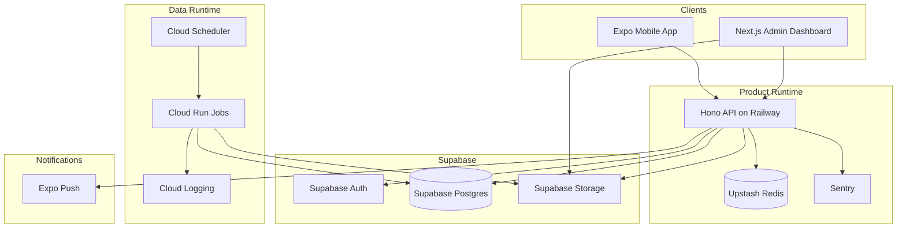

# Final Architecture Decision Record

## 1. Final Decision Summary

From Campus to Career will be implemented as a split-runtime system with a strict contract boundary:

```txt
Python owns offline data engineering.
TypeScript owns all user-facing product behavior.
Supabase Postgres is the shared contract and system of record.
```

Locked architectural decisions:

- Mobile app: React Native Expo + TypeScript.
- Admin dashboard: Next.js + TypeScript.
- API: Hono + TypeScript deployed on Railway for the MVP.
- Database: Supabase Postgres with Drizzle ORM and SQL migrations.
- Auth: Supabase Auth.
- Storage: Supabase Storage.
- Cache, idempotency, and rate limiting: Upstash Redis.
- Data engineering runtime: Python on Google Cloud Run Jobs.
- Job orchestration: Cloud Scheduler + API-triggered Cloud Run Job execution.
- Client server-state strategy: TanStack Query.
- Client local-state strategy: React state plus Zustand only for cross-screen transient UI state.
- API style: versioned REST under `/api/v1`.
- Career search strategy: deterministic alias plus trigram search in MVP, no pgvector in MVP.
- Student skill profile recomputation: synchronous on course or mapping changes for MVP.
- Eventing strategy: lightweight `app_events` outbox table in MVP.

## 2. System Architecture and Infra

### Runtime Topology



### Infra Boundaries

- Clients never connect directly to Postgres for product data.
- Clients use Supabase Auth for login, then call the Hono API for all product operations.
- The Hono API is the only runtime allowed to write transactional product data.
- Python jobs are the only runtime allowed to publish market-intelligence versions.
- Redis is an optimization layer only and can be bypassed without losing correctness.

### Monorepo and Build Standard

```txt
from-campus-to-career/
  apps/
    mobile/
    admin/
    api/
    data-pipeline/
  packages/
    shared/
    database/
    config/
    api-client/
```

- JavaScript package manager: `pnpm`.
- Monorepo task runner: `turbo`.
- Python environment management: `uv`.

## 3. Single Source of Truth Data Model

### Authoritative Data Ownership

The database is the single source of truth. Each domain concept has one authoritative write model.

| Domain Concept | Authoritative Source |
| --- | --- |
| Identity | `auth.users` in Supabase Auth |
| App user role and metadata | `users` table keyed 1:1 to `auth.users.id` |
| Student profile | `student_profiles` |
| Course catalog | `courses` |
| Student academic records | `student_courses` |
| Skill taxonomy | `skills` |
| Skill aliases | `skill_aliases` |
| Career taxonomy | `career_roles` |
| Career aliases | `career_role_aliases` |
| Course-to-skill mapping | `course_skills` |
| Dataset registry | `market_datasets` |
| Raw ingested market records | `job_postings` |
| Published role requirement version header | `role_requirement_versions` |
| Published role-skill requirements | `role_skill_requirements` |
| Published market snapshots | `sdi_snapshots` |
| Published decay signals | `skill_decay_signals` |
| Computed student skill profile header | `student_skill_profiles` |
| Computed student skill items | `student_skill_profile_items` |
| Persisted skill-gap header | `skill_gap_results` |
| Persisted skill-gap items | `skill_gap_result_items` |
| Recommendation library | `recommendation_catalog` |
| Student roadmap state | `roadmap_items` |
| Workflow and job state | `pipeline_jobs`, `app_events` |

### Data Ownership Rules

- `auth.users` is authoritative for identity existence and login lifecycle.
- `users` mirrors app-specific role and status metadata and must never diverge from `auth.users.id`.
- Admin-maintained reference data includes `skills`, `career_roles`, `courses`, `course_skills`, and `recommendation_catalog`.
- Python owns versioned market-intelligence outputs and never writes student-owned tables.
- TypeScript owns student-owned tables and never writes market-intelligence output tables except job bookkeeping tables.
- Immutable versioned outputs are never updated in place except to flip current-version pointers or status flags.

### Versioning Model

The system uses immutable snapshot versioning:

- `student_profiles.profile_version` increments when academic inputs change.
- `student_skill_profiles` stores one materialized profile per `student_id + profile_version`.
- `role_requirement_versions.version` identifies one published market-intelligence release.
- `skill_gap_results` is unique on `student_id + role_id + profile_version + role_requirement_version`.
- `roadmap_items` always reference the originating `analysis_result_id`.

### Required CSV Schema

The MVP dataset contract is fixed to these required columns:

- `external_id`
- `source`
- `title`
- `company`
- `location`
- `posted_at`
- `description`
- `url`

Optional columns:

- `employment_type`
- `salary_min`
- `salary_max`
- `currency`
- `experience_level`

### Data Retention Policy

- Raw uploaded CSVs: retain 180 days.
- Pipeline rejected-row payloads: retain 180 days.
- Job execution logs: retain 90 days in log storage.
- Published intelligence versions: retain current plus previous 3 versions online.
- Student analysis results and roadmap state: retain until user deletion or retention-policy change.

## 4. API Design and Integration Points

### API Style

- Protocol: HTTPS JSON REST.
- Base path: `/api/v1`.
- Auth model: Supabase JWT validated in API middleware.
- Validation model: Zod for every request and response boundary.
- Idempotent write requirement: `Idempotency-Key` header supported for `POST /skills/analyze` and admin-triggered ingestion endpoints.

### Final Route Groups

| Route Group | Purpose |
| --- | --- |
| `/auth/*` | session validation and logout |
| `/profile/*` | student profile and skill-profile retrieval |
| `/student/courses/*` | course and grade management |
| `/careers/*` | role search, role detail, role confirmation |
| `/skills/*` | skill-gap analysis, history, decay alerts |
| `/roadmap/*` | roadmap retrieval and progress mutation |
| `/admin/roles/*` | role taxonomy management |
| `/admin/skills/*` | skill taxonomy and alias management |
| `/admin/courses/*` | course catalog and mapping management |
| `/admin/datasets/*` | dataset registration and ingestion triggers |
| `/admin/pipeline-jobs/*` | pipeline monitoring |
| `/admin/recommendations/*` | recommendation catalog management |

### Integration Points

| Integration | Direction | Contract |
| --- | --- | --- |
| Supabase Auth | API validates JWT and loads app user | bearer token, user id, role claims |
| Supabase Postgres | API and Python read or write schema-controlled tables | Drizzle in TypeScript, SQLAlchemy Core plus Pydantic in Python |
| Supabase Storage | admin uploads datasets, Python downloads datasets | bucket path plus dataset metadata row |
| Upstash Redis | API cache, rate limit, and idempotency lookup | typed cache keys and TTL policies |
| Cloud Run Jobs | API triggers pipeline execution | job id plus dataset id plus execution parameters |
| Expo Push | API sends student notifications | notification payload contract |
| Optional LLM adapter | API or job uses asynchronous enrichment only | structured prompt input, structured explanation output |

### Search and Analysis Design Decisions

- Career search uses normalized exact match, alias match, and Postgres trigram search.
- `pg_trgm` is enabled in Supabase for fuzzy title and alias matching.
- `pgvector` is deferred until search relevance data proves it is needed.
- Skill-gap analysis is synchronous and deterministic in the API.
- Roadmap explanation enrichment is asynchronous and must never block the main response.

## 5. Data Flow and Request-Response Cycle

### A. Student Course Mutation

```txt
Student adds, updates, or deletes a course
-> API validates session and payload
-> API writes student_courses change
-> API increments student_profiles.profile_version
-> API recomputes student_skill_profiles for the new profile_version in the same request
-> API invalidates related Redis keys
-> API returns updated academic record summary
```

Reason for final decision:

- Student skill-profile recomputation is lightweight compared with market processing.
- Synchronous recomputation removes stale-profile race conditions in the MVP.
- This keeps `POST /skills/analyze` fast because the latest profile already exists.

### B. Career Search

```txt
Student types query
-> client debounces input
-> API normalizes query
-> API checks Redis cache
-> API queries exact role and alias matches
-> API queries trigram similarity fallback
-> API ranks and returns results
-> API caches response by normalized query and role index version
```

### C. Skill-Gap Analyze Request

```txt
Student taps Analyze
-> API validates JWT and request schema
-> API resolves student and target role
-> API loads current student skill profile
-> API loads current role requirement version and role_skill_requirements
-> API checks existing result by unique versioned key
-> if result exists, return stored snapshot
-> else compute readiness score and gap items
-> persist skill_gap_results and skill_gap_result_items
-> emit student.skill_gap.created app event
-> return analysis response
```

Rules:

- No Python call in request path.
- No raw `job_postings` scan in request path.
- No LLM call in request path.
- Response correctness comes from versioned published data plus deterministic scoring.

### D. Roadmap Request

```txt
Student opens roadmap
-> API loads latest or requested skill-gap result
-> API loads active recommendation_catalog items for top gaps
-> API creates missing roadmap_items if needed
-> API returns ordered roadmap
-> optional explanation enrichment runs from app_events consumer later
```

### E. Admin Dataset Ingestion Request

```txt
Admin registers dataset
-> API writes market_datasets row
-> API creates pipeline_jobs row
-> API emits admin.dataset.ingest_requested app event
-> API triggers Cloud Run Job with dataset id and pipeline_job id
-> Python pipeline validates and transforms source data
-> Python publishes new versioned intelligence tables
-> Python updates pipeline_jobs status and output version
-> Admin dashboard reads results through API
```

## 6. Tech State Management Strategy

### Client State vs Server State

Final rule:

```txt
Server data lives in TanStack Query.
Ephemeral UI state lives in component state.
Cross-screen transient UI state may use Zustand.
```

### Client-State Rules

- Use React state for form steps, modal visibility, local filters, and temporary input.
- Use Zustand only for cross-screen transient state such as draft onboarding progress or selected career draft before confirmation.
- Do not use Zustand, Redux, or Context as the primary store for server-fetched entities.

### Server-State Rules

- Use TanStack Query in mobile and admin for all API-backed reads and mutations.
- Query keys must include version-bearing identifiers when relevant.
- Mutations must invalidate or update only the directly affected query keys.
- Offline cache persistence in mobile is allowed only for low-risk reads such as career lists and latest analysis summaries.

### Cache Strategy

| Layer | Purpose | TTL |
| --- | --- | --- |
| Client TanStack Query cache | reduce duplicate refetches in session | 30s to 5m by screen type |
| Redis role search cache | repeated normalized role search | 15m |
| Redis analysis cache | repeated version-identical analyze reads | 30m |
| Redis idempotency keys | deduplicate retried analyze and ingest requests | 24h |

### Invalidation Strategy

- Course mutation invalidates student profile, skill profile, latest analysis, and roadmap query families.
- New `role_requirement_versions.is_current = true` invalidates all skill-gap and roadmap caches by version mismatch, not by broad delete.
- Career role or alias update invalidates role search caches by incrementing a role index version value.
- Recommendation catalog changes invalidate roadmap caches through `catalog_version`.

## 7. Final Coding Standards

### Software Engineering Standards

- Language: TypeScript with `strict` mode enabled.
- API schema: Zod on every public boundary.
- ORM: Drizzle ORM plus SQL migrations.
- Test framework: Vitest for unit and integration tests.
- Mobile and admin data access: generated typed API client from shared contracts.
- Logging: structured JSON logs with request id, actor id, route, and duration.
- Error handling: centralized typed error mapper with stable error codes.

### Data Engineering Standards

- Language: Python 3.12.
- Dataframe engine: Polars for tabular transformations.
- Validation: Pydantic models for stage contracts and publish contracts.
- Database write strategy: SQLAlchemy Core or parameterized SQL for explicit bulk operations.
- Test framework: pytest.
- Pipeline outputs must be reproducible from the same input dataset and configuration.

### Shared Standards

- Every external boundary needs runtime validation and static typing.
- Database migrations, TypeScript contracts, and Python publish models must evolve in the same change set.
- Every table that participates in request-path joins must have explicit indexes documented in schema migrations.
- Every versioned table must include creation timestamps and traceability back to the producing job or dataset.

## 8. Final Coding Rules

### Software Engineering Rules

- Business rules live in domain services, not in route handlers.
- Route handlers may orchestrate but may not contain scoring logic.
- Repositories may not return untyped `any` payloads.
- API responses must never expose raw database rows unless the response contract explicitly matches them.
- Each mutation endpoint must define cache invalidation behavior before implementation starts.
- No direct client use of Supabase service-role credentials.
- No LLM dependency for core correctness paths.

### Data Engineering Rules

- Python jobs may publish only to approved intelligence tables and pipeline bookkeeping tables.
- Python jobs must be restart-safe and idempotent for the same `dataset_id + source_file_hash`.
- Raw job text cleaning and normalization steps must preserve a traceable rejected-row reason when data is dropped.
- New derived metrics must document formula, input columns, output range, and validation checks.
- Publishing a new role requirement version must be atomic: either the version is fully published and marked current, or it is not current.

### Cross-Team Rules

- TypeScript engineers own student experience, APIs, and admin product features.
- Data engineers own ingestion, normalization, market-intelligence computation, and version publication.
- Shared schema changes require review from both software and data owners.
- No direct writes from mobile or admin apps to product tables.

## 9. Final Market Intelligence Rules

### Role Requirement Publishing

- `required_depth` is normalized to the range `0.0` to `1.0`.
- `demand_weight` is normalized to the range `0.1` to `1.0`.
- A role-skill pair is published only when evidence count is at least `5`.

### Initial SDI Formula

The MVP Skill Demand Index uses a deterministic weighted score:

```txt
SDI = 0.50 * frequency_share
    + 0.30 * recency_score
    + 0.20 * growth_score
```

Where:

- `frequency_share` = share of role postings mentioning the skill in the current window.
- `recency_score` = normalized freshness of postings mentioning the skill.
- `growth_score` = normalized change versus the previous comparable window.

### Initial Decay Rule

A skill is marked as decaying for a role when:

- at least 3 snapshots exist,
- the rolling SDI slope is below `-0.10`,
- and confidence is at least `0.70`.

## 10. Success Criteria

The architecture is considered finalized and build-ready when all of the following are true.

### Functional Success Criteria

- A student can sign in, manage profile and course data, confirm a role, run analysis, and track roadmap progress only through the API.
- An admin can manage taxonomy, mappings, recommendations, datasets, and pipeline jobs through the admin application.
- Python can ingest a dataset and publish a new requirement version without manual database edits.

### Performance Success Criteria

- Career search p95 latency is under 800ms with warm cache and under 1.2s on cache miss.
- Skill-gap analysis p95 latency is under 1s for existing materialized student profiles.
- The system supports 1,000 concurrent analysis requests without invoking Python in the request path.

### Data Contract Success Criteria

- TypeScript contract tests pass against Python-published sample outputs.
- No duplicate `skill_gap_results` rows exist for the same `student_id + role_id + profile_version + role_requirement_version`.
- Every published market-intelligence row is traceable to a dataset version and pipeline job.

### Reliability Success Criteria

- If a pipeline run fails, the latest successful published version remains readable by the app.
- If Redis is unavailable, core user flows still succeed against Postgres.
- If enrichment fails, deterministic analysis and roadmap generation still succeed.

### Security Success Criteria

- Student requests are restricted to the authenticated student's own data.
- Admin routes require explicit admin authorization.
- No client bundle or mobile binary contains service-role credentials.

### Engineering Success Criteria

- `arch.md`, `HLD.md`, and `LLD.md` contain no unresolved architecture placeholders.
- Every public API contract has shared schema definitions.
- Every schema change requires migrations, shared contract updates, and cross-runtime contract tests.

## 11. Hosting Decision Note

The MVP hosting split is intentional:

- Hono API runs on Railway to reduce deployment and operational friction during early product development.
- Python data jobs run on Google Cloud Run Jobs because the pipeline is batch-oriented and schedule-driven.
- The API may later migrate from Railway to Cloud Run without changing the core architecture, data model, or runtime ownership boundaries.

## 12. Deferred, Not Open

These are intentionally deferred enhancements, not unresolved architecture decisions:

- semantic search with `pgvector`
- adviser-facing dashboards
- institution-level analytics
- richer evidence sources beyond course grades
- advanced workflow orchestration with Temporal
- LLM-generated personalized explanations and coaching
